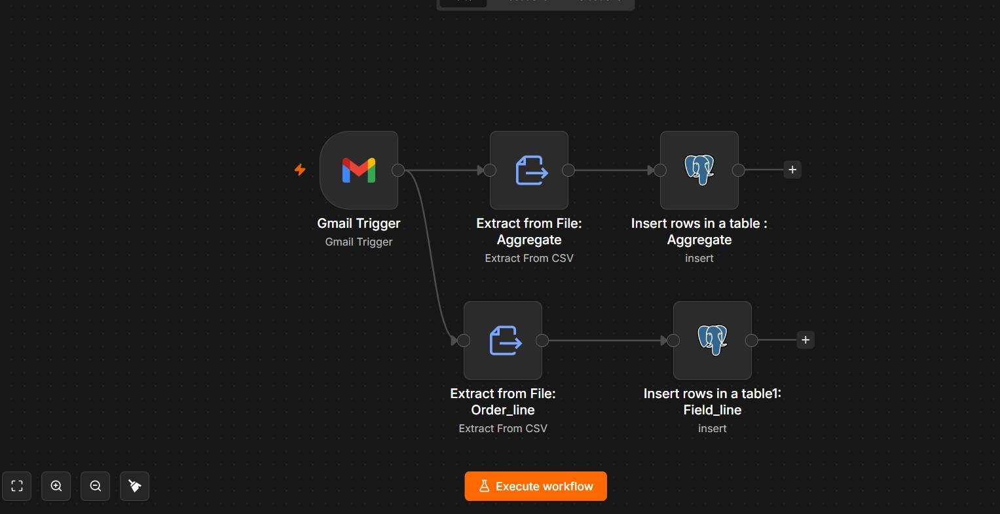

## AI-Powered Supply Chain Analytics & Automation Pipeline
    Automated ETL | Gmail | n8n | Supabase (PostgreSQL) | Python | Quadratic

## 📌 Table of Contents

- [Overview](#overview)
- [Business Problem](#business-problem)
- [Solution Architecture](#solution-architecture)
- [Project Workflow](#project-workflow)
- [Datasets](#datasets)
- [Data Model](#data-model)
- [Tools & Technologies](#tools--technologies)
- [Data Cleaning & Preparation](#data-cleaning--preparation)
- [Exchange Rate Conversion](#exchange-rate-conversion)
- [Fact Summary Creation](#fact-summary-creation)
- [KPI Summary](#kpi-summary)
- [Business Insights](#business-insights)
- [Repository Structure](#repository-structure)
- [Project Resources](#project-resources)

## **Overview**

This project automates the complete Supply Chain Analytics workflow using **n8n**, **Supabase PostgreSQL**, **Python**, and **Quadratic**.

The workflow automatically loads CSV datasets received via Gmail into PostgreSQL, performs data cleaning and transformations, creates analytical tables, calculates business KPIs, and generates customer-level insights.

---

## **Business Problem**

Supply chain managers need an automated system to:

- Ingest incoming order datasets automatically
- Store transactional data centrally
- Calculate operational KPIs
- Monitor delivery performance
- Identify high-value customers
- Analyze order fulfillment performance

## **Solution Architecture**

```text
CSV Files (Email)
        │
        ▼
 Gmail Trigger
        │
        ▼
      n8n
        │
        ▼
Supabase PostgreSQL
        │
        ▼
Quadratic + Python
        │
        ▼
Fact Summary
        │
        ├── KPI Summary
        ├── Customer Insights
        └── Charts
```

## **Project Workflow**

### **Step 1: Receive Incoming Datasets**

Incoming CSV datasets are received through **Gmail**.

---

### **Step 2: Automated Data Ingestion using n8n**

Using **n8n**:

- Gmail Trigger monitors incoming emails
- CSV attachments are extracted automatically
- Data is inserted into **Supabase PostgreSQL**

---

### **Step 3: Data Warehouse Creation**

Created **Dimension Tables**:

- `dim_customers`
- `dim_products`
- `dim_targets_orders`
- `dim_date`

Created **Fact Tables**:

- `fact_order_line`
- `fact_aggregate`

---

### **Step 4: Exchange Rate Generation**

Generated historical exchange rates using the **Open Exchange Rates Historical API** to convert **USD** order values into **INR**.

---

### **Step 5: Fact Summary Creation**

Merged the following tables:

- `fact_order_line`
- `dim_products`
- `dim_customers`
- `exchange_rates`

to create the final analytical table:

- `fact_summary`

---

### **Step 6: KPI Calculation**

Calculated the following Supply Chain KPIs:

- Total Order Lines
- Line Fill Rate
- Volume Fill Rate
- Total Orders
- On Time Delivery %
- In Full Delivery %
- On Time In Full (OTIF) %

---

### **Step 7: Business Insights & Visualization**

Generated business insights including:

- Top 5 Customers based on Total Order Value
- Top 5 Customers (India) based on Total Order Value
- Monthly On-Time Delivery Performance by City
- KPI Summary Dashboard
  

# Datasets

### Incoming CSV Files

The project uses the following CSV datasets received through **Gmail**, which are automatically processed by the **n8n** workflow and loaded into **Supabase PostgreSQL**.

- `fact_order_line_india_2025-05-17.csv`
- `fact_order_line_usa_2025-05-17.csv`
- `fact_aggregate_india_2025-05-17.csv`
- `fact_aggregate_usa_2025-05-17.csv`

---

### Dimension Tables

The following dimension tables were used to enrich transactional data and build the analytical data model.

| Table | Description |
|--------|-------------|
| `dim_customers` | Customer master data including customer details and city |
| `dim_products` | Product master data including product pricing and currency |
| `dim_targets_orders` | Target metrics for OT, IF and OTIF analysis |
| `dim_date` | Date dimension generated using Python for calendar-based analysis |

---

### Fact Tables

The following fact tables were used for supply chain analytics.

| Table | Description |
|--------|-------------|
| `fact_order_line` | Order line-level transactional data |
| `fact_aggregate` | Order-level delivery performance data |
| `fact_summary` | Final consolidated analytical table created by merging dimension tables, fact tables, and exchange rates |

---

### Exchange Rate Table

Historical exchange rates were generated using the **Open Exchange Rates Historical API** to convert **USD** order values into **INR** before analysis.

**Currency Conversion**

- USD → INR

**Date Range**

- 01 March 2025
- 17 May 2025

---

# Data Model

### Dimension Tables

The following dimension tables were used to enrich transactional data and support the analytical data model.

| Table | Description |
|--------|-------------|
| `dim_customers` | Customer information including customer details and city |
| `dim_products` | Product information including pricing and currency |
| `dim_targets_orders` | Target values for On-Time (OT), In-Full (IF), and On-Time In-Full (OTIF) performance |
| `dim_date` | Calendar dimension generated using Python for time-based analysis |

---

### Fact Tables

The following fact tables store transactional and delivery performance data used for analytics.

| Table | Description |
|--------|-------------|
| `fact_order_line` | Order line-level transactional data |
| `fact_aggregate` | Order-level delivery performance data |
| `fact_summary` | Final consolidated analytical dataset created by merging fact tables, dimension tables, and exchange rate data |

---

# Tools & Technologies

The following tools and technologies were used throughout the project.

| Category | Technology |
|----------|------------|
| Email Automation | Gmail |
| Workflow Automation | n8n |
| Database | Supabase PostgreSQL |
| Programming Language | Python |
| Data Processing | Pandas, NumPy |
| Analytics Platform | Quadratic |
| Visualization | Plotly |
| API Integration | Open Exchange Rates Historical API |

---

# Data Cleaning & Preparation

The following preprocessing and transformation steps were performed before analysis.

- Converted `product_id` and `customer_id` to numeric data types.
- Removed rows containing NULL IDs.
- Trimmed leading and trailing whitespaces from key columns.
- Converted date columns to `datetime` format.
- Merged dimension and fact tables using appropriate keys.
- Converted USD order values into INR using daily exchange rates.
- Removed intermediate and unnecessary columns.
- Generated a consolidated analytical dataset (`fact_summary`) for reporting and analysis.

---

# Exchange Rate Conversion

Historical exchange rates were generated using the **Open Exchange Rates Historical API** to convert **USD** order values into **INR** before performing business analysis.

### Business Logic

**For USD Orders**

```text
Total Amount = Price_USD × USD_INR_Rate × Order Quantity
```

**For INR Orders**

```text
Total Amount = Price_INR × Order Quantity
```

All order values were converted into **Indian Rupees (INR)** before analysis.
```

**For INR Orders**

```text
Total Amount = Price_INR × Order Quantity
```

All order values were standardized and stored in **Indian Rupees (INR)** for consistent reporting and comparison.

---

## **KPI Summary**

The following Supply Chain KPIs were generated from the consolidated **fact_summary** dataset.

| **KPI** | **Value** |
|----------|----------:|
| **Total Order Lines** | **24,530** |
| **Line Fill Rate** | **65.95%** |
| **Volume Fill Rate** | **96.60%** |
| **Total Orders** | **13,652** |
| **On Time Delivery** | **59.22%** |
| **In Full Delivery** | **52.62%** |
| **On Time In Full (OTIF)** | **28.74%** |


## **Business Insights**

The following business insights were generated from the **fact_summary** dataset to identify high-value customers and evaluate their delivery performance using **OTIF**, **In Full (IF)**, and **On Time (OT)** metrics.

---

### **Top 5 Customers (Overall)**

The table below highlights the **Top 5 customers based on Total Order Value (INR)** across all available data.

| **Customer ID** | **Customer Name** | **City** | **Total Order Value (INR)** | **OTIF %** | **IF %** | **OT %** |
|:---------------:|-------------------|----------|----------------------------:|-----------:|---------:|---------:|
| 789301 | Foodtown | New Jersey, US | 51,308,165 | 30.98% | 56.25% | 68.75% |
| 789320 | Whole Foods Market | New Jersey, US | 50,681,975 | 37.15% | 58.94% | 70.39% |
| 789420 | Lidl | New Jersey, US | 50,597,074 | 21.75% | 67.96% | 28.93% |
| 789401 | Wegmans | New Jersey, US | 49,909,678 | 35.92% | 55.75% | 71.55% |
| 789601 | Price Rite | New Jersey, US | 49,286,806 | 8.77% | 17.26% | 71.51% |

---

### **Top 5 Customers (India)**

The table below highlights the **Top 5 customers in India based on Total Order Value (INR)** along with their delivery performance metrics.

| **Customer ID** | **Customer Name** | **City** | **Total Order Value (INR)** | **OTIF %** | **IF %** | **OT %** |
|:---------------:|-------------------|----------|----------------------------:|-----------:|---------:|---------:|
| 789402 | Propel Mart | Ahmedabad | 18,726,559 | 64.7% | 74.4% | 86.3% |
| 789521 | Acclaimed Stores | Ahmedabad | 18,464,448 | 18.3% | 73.1% | 26.5% |
| 789902 | Elite Mart | Ahmedabad | 18,463,957 | 65.9% | 76.1% | 86.3% |
| 789102 | Vijay Stores | Ahmedabad | 18,339,388 | 59.8% | 73.5% | 82.5% |
| 789503 | Viveks Stores | Vadodara | 18,188,178 | 62.7% | 77.0% | 82.0% |

---

### **Monthly Delivery Performance**

An interactive **Plotly line chart** was created to analyze **Monthly On-Time Delivery Performance (%)** across different cities from **March 2025 to May 2025**, enabling comparison of delivery trends and operational performance over time.


---

# **Repository Structure**

```text
Supply-Chain-Analytics-Automation/
│
├── data/
│   ├── fact_order_line_india_2025-05-17.csv
│   ├── fact_order_line_usa_2025-05-17.csv
│   ├── fact_aggregate_india_2025-05-17.csv
│   └── fact_aggregate_usa_2025-05-17.csv
│
├── images/
│   ├── workflow.png
│   ├── architecture.png
│   ├── kpi_summary.png
│   ├── top5_customers.png
│   ├── top5_customers_india.png
│   └── monthly_ot_performance.png
│
├── README.md
└── LICENSE
```

---

# **Project Resources**

### **Quadratic Workbook**

https://app.quadratichq.com/file/7a6c51b4-870c-42f9-a0d2-aeb5d8938193

### **Supabase Database**

Project developed using **Supabase PostgreSQL**.

> Note: The Supabase dashboard requires authentication and cannot be accessed publicly.

## **n8n Workflow**

The workflow automatically monitors Gmail for incoming CSV attachments, extracts the datasets, and inserts them into Supabase PostgreSQL.

<p align="center">
  
</p>

### **Exchange Rate API**

Open Exchange Rates Historical API

https://openexchangerates.org/

### **Project Documentation**

- README.md
- Architecture Diagram
- Workflow Diagram
- KPI Dashboard
- Business Insights
